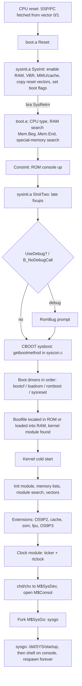

# OS-9/68K Porting Primer

A guide to bringing Microware OS-9 for 68K ("OSK") up on a new 68000-family
board, written around the port trees in this repository (`ports/CB030` and
`ports/AtariST`).

It covers:

1. [What you are porting (and what you are not)](#1-what-you-are-porting-and-what-you-are-not)
2. [How OS-9/68K works](#2-how-os-968k-works)
3. [The boot process, end to end](#3-the-boot-process-end-to-end)
4. [Memory map requirements](#4-memory-map-requirements)
5. [Vectors, exceptions, interrupts and traps](#5-vectors-exceptions-interrupts-and-traps)
6. [Anatomy of a port tree](#6-anatomy-of-a-port-tree)
7. [Bring-up plan for a new board](#7-bring-up-plan-for-a-new-board)
8. [Driver and module interfaces cheat sheet](#8-driver-and-module-interfaces-cheat-sheet)
9. [Gotchas collected from the existing ports](#9-gotchas-collected-from-the-existing-ports)
10. [References](#10-references)

> **About sources.** Statements about this repo come from its sources. Kernel
> internals come from Microware's *OS-9 Technical Manual* (v2.4) and *OEM
> Installation Manual* (see [References](#10-references)). The SDK's `boot.a`,
> `vectors.a`, `init.a` and `tickgeneric.a` are the final word on exact
> behaviour. Read them in `$(MWOS)/OS9/SRC` whenever this primer and the code
> disagree.

---

## 1. What you are porting (and what you are not)

OS-9/68K is a closed-source, binary-distributed OS. **The kernel, file
managers, shell and utilities are not in this repo.** They come prebuilt
from the *OS-9 for 68K SDK* (v1.2), unpacked at `M:\MWOS` (or wherever
`$MWOS` points). A port supplies only the board-specific parts:

| You write (per board)                           | You reuse from the SDK                                  |
|-------------------------------------------------|---------------------------------------------------------|
| `systype.d` / `systype.h`: the board definition  | Kernel (`dker0x0s`, …), `ioman`                         |
| ROM bootstrap glue: `sysinit.a`, `syscon.c`, ROM console I/O, ROM boot drivers | ROM framework: `vectors.a`, `boot.a`, `sysboot.l`, `romio.l`, `rombug.l` |
| Tick (system clock) driver                      | `tickgeneric.a` (generic half of the ticker)            |
| Real-time clock (`rtclock`) module              | File managers: `scf`, `rbf`, `pipeman`, `sbf`           |
| Device drivers (serial, disk, …)                | Generic drivers: `pipe`, `null`, `nil`, some UART drivers (e.g. `sc68681`) |
| Device descriptors (`term`, `t1`, `c0`, `dd`, …) | Descriptor templates (`SCFDesc` macro, `rbfdesc.a`)      |
| Init module configuration (`CONFIG` macro)      | `init.a` (assembled against your `systype.d`)            |
| Bootlists (`*.bl`)                              | `sysgo`, `mshell`, `csl`, `cio`, cache/MMU/FPU modules   |

Most porting work is **configuration** (`systype.d`) plus **a small number
of hardware drivers**. Everything is a *module*, so a working system is a
set of modules collected into a *bootfile*.

### SDK modules by CPU

The CPU sets which kernel and support modules you list in the bootfile
(from `dist/filesets/bootobjs` and the bootlists):

| CPU            | Kernel (dev, std allocator) | Cache module | MMU / protection | Other                     |
|----------------|-----------------------------|--------------|------------------|---------------------------|
| 68000 / 68008  | `68000/…/dker000s`          | —            | —                | `fpu` (FP emulation)      |
| 68010          | `68000/…/dker010s`          | —            | —                | `fpu`                     |
| 68070          | `68000/…/dker070s`          | —            | —                |                           |
| 68020          | `68020/…/dker020s`          | `cache020`   | `ssm851` (68851) |                           |
| 68030          | `68020/…/dker030s`          | `cache030`   | `ssm851`         | `fpu`                     |
| 68040          | `68040/…/dker040s`          | `cache040`   | `ssm040`         |                           |
| 68060          | `68060/…/dker060s`          | `cache060`   | `ssm060`         | `fpsp060`, `intsp060`     |

The `s` kernel variants use the standard memory allocator (per the
bootlist comments); `b` variants also exist. User commands for 68000/010/070
come from `OS9/68000/CMDS`. For 020 and later, look in `OS9/68020/CMDS`
first and fall back to `OS9/68000/CMDS` (see `dist/Layout.md`).

---

## 2. How OS-9/68K works

### 2.1 Everything is a module

Code and configuration live in memory *modules* with a fixed header and a
CRC. The kernel keeps a **module directory** of every module it has found or
loaded. Modules are found by name (`F$Link`), are position-independent, and
are shared: two processes running the same program share one copy of the
code, each with its own data area.

Standard module header (offsets from `sys.l`):

| Offset | Name       | Meaning                                        |
|--------|------------|------------------------------------------------|
| `$00`  | `M$ID`     | Sync bytes `$4AFC`                             |
| `$02`  | `M$SysRev` | Header revision                                |
| `$04`  | `M$Size`   | Module size (including CRC)                    |
| `$08`  | `M$Owner`  | Owner (group.user)                             |
| `$0C`  | `M$Name`   | Offset to name string                          |
| `$10`  | `M$Accs`   | Access permissions                             |
| `$12`  | `M$Type`   | Type: Prgrm, Sbrtn, Systm, FlMgr, Drivr, Devic, Data, Trap… |
| `$13`  | `M$Lang`   | Language (Objct, …)                            |
| `$14`  | `M$Attr`   | Attributes (ReEnt, SupStat, sticky…)           |
| `$15`  | `M$Revs`   | Revision                                       |
| `$16`  | `M$Edit`   | Edition                                        |
| `$18`  | `M$Usage`  | Offset to usage comment                        |
| `$1C`  | `M$Symbol` | Symbol table                                   |
| `$2E`  | `M$Parity` | Header parity                                  |
| `$30…` | —          | Type-specific fields, body, then 3-byte CRC     |

In assembly, a module is declared with `psect name,Typ_Lang,Attr_Rev,Edition,Stack,Entry`.
For example, the CF driver uses
`psect Ram,(Drivr<<8)+Objct,((ReEnt+SupStat)<<8)+0,Edition,0,EntryTable`.
The linker (`l68`) makes the module image and its CRC.

A **bootfile** (`*.bf`) is a set of modules concatenated with `os9merge`. A
**ROM image** is the bootstrap code followed by an optional bootfile.

### 2.2 The four levels

```
                 User programs, shell, utilities
                               │  TRAP #0 (system calls)
       ┌───────────────────────┼─────────────────────────┐
 Init ─┤          OS-9 KERNEL (+ IOMan, extensions)      ├─ Trap handlers
 Clock │                       │                         │  (cio=13, math=15)
       └───────────────────────┼─────────────────────────┘
          File managers:  SCF   RBF   PIPEMAN   SBF
                               │
          Device drivers:  sc68681  cfide  sc_mfp_uart  pipe …
                               │
          Device descriptors:  term  t1  c0  c0_fmt  dd …
```

* **Kernel.** Process scheduling, memory, the module directory, signals,
  events, and system call dispatch. In v3.x the I/O plumbing is split into a
  separate `ioman` module, which this repo uses as `ioman_DEV`.
* **Init.** A non-executable `Systm` module of configuration data. The
  kernel reads it at cold start ([§3.4](#34-kernel-cold-start)).
* **Clock (ticker).** Drives the system tick for time slicing and timeouts.
  The `rtclock` subroutine module supplies wall-clock time.
* **Extension modules.** System-state modules that the kernel calls at cold
  start: `OS9P2`, `OS9P3`, `syscache`/`cache030`, `ssm`, `fpu`. They usually
  install or patch system calls.
* **File managers.** Handle a class of device. SCF: serial/terminal, with
  line editing. RBF: random block devices, the disk filesystem. PIPEMAN:
  pipes. SBF: tape.
* **Device drivers.** Hardware access only. They take logical
  requests from the file manager ("read LSN *n*", "write one character").
* **Device descriptors.** Small data modules binding a *name* (`/term`)
  to a file manager, driver, port address, IRQ vector/level/priority and
  default options. One driver can serve many descriptors.

### 2.3 Processes, state, scheduling

* **One address space.** All processes share a single memory map. On
  CPUs with an MMU, `ssm` (System Security Module) adds per-process
  protection. Without it, protection is cooperative.
* **User state and system state.** User programs run in 68K user mode.
  The kernel, file managers, drivers, ISRs and modules with the `SupStat`
  attribute run in supervisor mode. **System-state code is not
  time-sliced**, so drivers must not spin for long.
* **Preemptive, priority/age scheduling.** Each tick ages waiting
  processes. The Init fields `M$Slice`, `M$SysPri`, `M$MinPty` and
  `M$MaxAge` tune the scheduler.
* **IPC.** Signals (`F$Send`), events (`F$Event`), pipes and data modules.
  Drivers use the standard sleep/wake pattern: set `V_WAKE`, call
  `F$Sleep`, and the ISR does `F$Send` to the waiting process. See
  `ports/AtariST/SCF/sc_mfp_uart.a`.

### 2.4 System calls

```asm
    OS9     I$Read          ; the assembler expands this to:
                            ;   trap #0
                            ;   dc.w I$Read
```

* Arguments and results go in registers.
* **Carry clear** means success. **Carry set** means error, with the code
  in `d1.w`.
* `F$xxx` are function calls. Some are system-state only (`F$IRQ`,
  `F$SRqMem`, `F$Move`…).
* `I$xxx` are I/O calls, routed by IOMan to the file manager, then the
  driver.
* Inside system state, use the `OS9svc` macro (`<os9svc.m>`) for fast
  internal calls, as the SCF driver does.

---

## 3. The boot process, end to end



### 3.1 Stage 0 – ROM vectors (`vectors.a`, SDK)

The ROM begins with a 68K vector table (`VTblSize equ 256*4`). Vector 0 is
the initial SSP and vector 1 is the reset PC, which points to `Reset:` in
`boot.a`. The ROM is linked at `ROM_BASE` (set in the port `makefile`):
`fe000000` on the CB030, `00e00000` on the Atari ST.

The CPU fetches its reset SSP/PC from address 0. Your hardware must
therefore either map ROM at 0 during reset (the "ROM-over-RAM" overlay on
the CB030, or the Atari's hard-wired 8-byte shadow), or have the reset
logic otherwise supply them.

### 3.2 Stage 1 – ROM bootstrap (`boot.a` plus your `sysinit.a`)

`boot.a` is prewritten and is not edited. It calls into your board code at
fixed labels:

| Label you provide | When                                  | Must do                                                                 |
|-------------------|---------------------------------------|-------------------------------------------------------------------------|
| `SysInit`         | Right after reset, no stack or RAM yet | Make RAM usable (undo ROM overlay, refresh/configure DRAM), silence noisy hardware (stop the ticker, reset UARTs/PICs), set up caches/MMU (normally **off** or transparent), set **VBR** (010+), **copy reset vectors 0/1 into the RAM vector table**, set boot flags in USP. Return with **`bra SysRetrn`**, not `rts`. |
| `SInitTwo`        | After the memory search and `ConsInit` | Late setup. Return with `rts`. The Atari port patches the HBL/VBL vectors here. |
| `UseDebug`        | Before booting                        | Return **Z clear** to enter RomBug, **Z set** to boot. CCR is saved around the call. |
| `PortMan`         | (data)                                | Ident string, e.g. `"portman for cb030"`.                                |
| ROM console: `ConsInit`, `InChar`, `InChChek`, `OutChar`, `OutRaw`, `ConsSet`, `ConsDeIn`, and aux `PortInit`, `InPort`, `OutPort`, `ChekPort`, `PortDeIn` | Polled, no interrupts | Polled serial I/O for the booter and RomBug. Use an SDK driver (`ROM/SERIAL/io68681.a`) or write one (`AtariST/ROM_CBOOT/io_mfp_uart.a`). |

**Boot flags in USP.** `boot.a` passes a flag word to `SysInit` in USP,
which SysInit edits and puts back. Flags used in this repo:

* `B_SkipParity`: don't pattern-fill (parity-initialise) RAM. Saves time.
* `B_NoDebugCall`: don't drop into the debugger.
* `B_NoIRQMask`: leave interrupts unmasked during boot. The Atari port must
  **not** set this, or HBL/VBL interrupts flood it.

**Why copy the reset vectors to RAM?** The kernel locates the **system
global data** through vector 0, the reset SSP. On the 68000 it reads
address 0. On the 010+ it reads `0(VBR)`. The RAM vector table must
therefore hold a valid SSP:

```asm
    movea.l VBRPatch(pc),a0     ; vector base chosen by boot.a/systype.d
    movec   a0,vbr
    move.l  VectTbl(pc),0(a0)   ; reset SSP
    move.l  VectTbl+4(pc),4(a0) ; reset PC
```

After `SysRetrn`, `boot.a`:

* determines the CPU type. `FIXED_CPUTYP` skips the probe and trusts
  `CPUTyp`.
* searches RAM using the `MemDefs` list, from `Mem.Beg` to `Mem.End`.
* searches special memory (`Spc.Beg`..`Spc.End`, normally ROM) for modules.
* calls `ConsInit`, `SInitTwo` and `UseDebug`.
* enters the boot menu.

### 3.3 Stage 2 – choosing and loading a bootfile (CBOOT)

With `CBOOT set 1`, the booter is the C framework in `sysboot.l`. Your
`syscon.c` registers boot methods in priority order:

```c
int getbootmethod(void)
{
    iniz_boot_driver(bootcf,   "", "boot from CompactFlash", "");
    iniz_boot_driver(loadrom,  "", "download from ROM", "");   /* bootfile appended to ROM */
    iniz_boot_driver(sysreset, "", "reset the system", "");
    vflag = TRUE;
    return AUTOSELECT;   /* try each in turn, no menu */
}
```

Standard methods include `loadrom` (copy a bootfile out of the ROM image
into RAM) and `romboot` (run modules in place from ROM). The Atari port
uses `romboot`.

A **disk boot driver** fills four hooks and calls the SDK's `diskboot()`.
That function reads sector 0, finds the bootfile that `os9gen` installed
and loads it:

```c
error_code bootcf(void)
{
    defopts    = &cf_hbd;   /* path options from <bootdesc.h> */
    inizdriver = cf_iniz;   /* bring device up */
    readdriver = cf_read;   /* read(numsects, lsn) into pathbuf */
    termdriver = NULL;
    return diskboot();
}
```

See `ports/CB030/ROM_CBOOT/io_cf.c`. Boot drivers poll with no
interrupts and print through `outstr()`.

The booter then finds the kernel module in the loaded bootfile and jumps
to it. You will see `An OS-9 kernel module was found at $...`.

### 3.4 Kernel cold start

The kernel (from the SDK, nothing to write) then:

1. **Finds the `Init` module** and reads its configuration.
2. **Builds the memory pools** from the `M$MemList` colored-memory list,
   or from what the ROM found if there is no list. Blocks marked `B_ROM`
   are searched for modules. `B_PARITY` blocks are initialised unless
   skipped.
3. **Adds every valid module** in ROM and in the bootfile to the module
   directory.
4. **Installs its exception and interrupt handlers** in the vector table
   ([§5](#5-vectors-exceptions-interrupts-and-traps)) and sets up system
   globals (the `D_` variables) at the reset-SSP location.
5. **Runs extension modules** named in `M$Extens`, in order (CB030:
   `"OS9P2 syscache ssm fpu OS9P3"`). Missing names are skipped, so the
   list can be generic.
6. **Starts the clock module** `M$Clock` (e.g. `tkcb030`): the tick ISR is
   installed through `F$IRQ`, `StartTick` is called, and `rtclock` is read
   for the time. Setting bit 5 of `M$Compat` suppresses this.
7. **Changes directory to `M$SysDev`** (`/dd`), with `M$ColdTrys`
   retries. ROM-only systems set `SysDev equ 0` (`init_rom`) so no disk is
   needed.
8. **Opens `M$Consol`** (`/term`) as stdin/stdout/stderr.
9. **Forks `M$SysGo`** (`sysgo`) with `M$SParam` at priority `M$SysPri`.

### 3.5 Userland start

* **`sysgo`** changes the execution directory to `CMDS`, runs the
  `startup` script, forks a shell on the console and respawns it when it
  exits.
* **`sysgo_nodisk`** is used in ROM-only bootfiles. It doesn't need a disk.
* **`startup`** for this distribution is `dist/SYS/startup`. It runs
  `chx /dd/CMDS`, `loadfile`, `motd` and optionally `tsmon` on `/t1`.
* As an alternative, set `SysStart` to `shell` and `SysParam` to e.g.
  `"startup; ex tsmon /term"`.

---

## 4. Memory map requirements

### 4.1 What OS-9 needs

| Region                      | Requirement                                                                 |
|-----------------------------|-----------------------------------------------------------------------------|
| **Reset vectors** (8 bytes) | Readable at address 0 at reset time: SSP then PC.                           |
| **Vector table** (1 KiB)    | 256 × 4 bytes at `VBRBase`. On the **68000/008 it must be at 0**. On 010+ VBR can put it anywhere, which is how the Atari port avoids the ROM shadow at 0–7 (`VBRBase equ $8`). With `RAMVects set 1` it must be **RAM**, because the kernel writes its handlers into it. |
| **System globals**          | Located at the **reset SSP value**, normally the bottom of RAM just above the vectors. The manual requires **≥4 KiB of RAM below and ≥4 KiB above** that address, and at least 8 KiB overall for kernel use. |
| **General RAM**             | One or more blocks from `Mem.Beg` to `Mem.End`. Start `Mem.Beg` **above the vector table** (CB030: `$400`; Atari: `$1000` to stay clear of the VBR-shifted table). Microware recommends contiguous RAM in 8 KiB multiples, with at least 128 KiB. Real systems want far more. The kernel allocates **from the top down**, so modules load high. |
| **ROM / module search area** | `Spc.Beg`..`Spc.End`. The booter and kernel scan it for modules (the `$4AFC` sync plus a valid header and CRC). Size it to the ROM. |
| **I/O**                     | Anywhere, but **68000/010 have only a 24-bit bus**: peripherals must be below `$1000000`. This is why the README rules out QEMU-virt (devices above `$ff000000`) for 000/010 kernels. |
| **Bootfile load area**      | `loadrom`/`diskboot` load the bootfile into RAM from the pool. Nothing to reserve. |

### 4.2 How memory is described

There are two lists, and they serve different stages.

**ROM memory lists** (`MemDefs` macro in `systype.d`, consumed by
`vectors.a`/`boot.a`):

```asm
MemDefs macro
    dc.l    Mem.Beg,Mem.End     ; RAM to search/use
    dc.l    0
    dc.l    Spc.Beg,Spc.End     ; special memory: search for modules
    dc.l    0
    endm
```

**Colored memory list** (`MemList` inside the `CONFIG` macro, ends up in
the Init module):

```asm
MemList:
*           type,  prio,attributes,blksize,start,  end,    name,    DMA/bus offset
    MemType SYSRAM,250, B_USER,    $1000,  _RAMBase,_RAMMax,DRAMName,_RAMBase
    dc.l    0
```

* **type:** `SYSRAM` (1), `VIDEO1` (`$80`) or `VIDEO2` (`$81`). Use your
  own types for special RAM such as battery-backed, video or DMA-able
  memory.
* **prio:** 0–255. Higher is allocated first. 0 means "only on an explicit
  request for this color".
* **attributes:** `B_USER` (processes may allocate it), `B_PARITY` (the
  kernel initialises it), `B_ROM` (search it for modules, never allocate).
* **blksize:** granularity of the kernel's RAM/ROM probe in that region.
* **DMA offset:** the bus address as seen by DMA masters, used by
  `F$Trans`. Use 0 if not applicable.

Keep the ROM list to the RAM the booter can safely use. Put the full
picture, including expansion RAM, in `MemList`, so changing the memory map
only requires a new Init module, not a new ROM.

### 4.3 Worked examples from this repo

**CB030** (68030, `ports/CB030/systype.d`):

| Address range              | Use                                               |
|----------------------------|---------------------------------------------------|
| `$00000000–$000003FF`      | Vector table (VBR = 0, RAM)                       |
| `$00000400–$00FFFFFF`      | DRAM, 16 MiB (`Mem.Beg`..`Mem.End`)              |
| `$FE000000–$FE07FFFF`      | 512 KiB flash: booter (+RomBug) + bootfile        |
| `$FFFF8000`                | Write: disable ROM-over-RAM overlay               |
| `$FFFF9000` / `$FFFF9800`  | 100 Hz ticker: write anything to start            |
| `$FFFFE000`                | CompactFlash, 8-bit "compact" register layout     |
| `$FFFFF000` / `$FFFFF010`  | MC68681 DUART ports A/B (vector 80, IPL 3); GPIO bit-bangs the DS1302 RTC and debug LEDs |

**Atari Mega ST** (68010 under Hatari, `ports/AtariST/systype.d`):

| Address range              | Use                                               |
|----------------------------|---------------------------------------------------|
| `$00000000–$00000007`      | ROM shadow (hardware), so the vectors can't live here |
| `$00000008–$00000407`      | Vector table (VBR = `$8`)                         |
| `$00001000–$003FFFFF`      | ST RAM, 4 MiB                                     |
| `$00E00000–$00E7FFFF`      | 512 KiB ROM: fake TOS header + booter + bootfile  |
| `$00F00000`                | IDE (Atari register spacing, 16-bit data)         |
| `$00FFFA01`                | MC68901 MFP: UART, Timer C tick (vector base `$40`, IPL 6) |

---

## 5. Vectors, exceptions, interrupts and traps

### 5.1 Vector assignments (as owned by the kernel)

| Vector   | Offset    | Exception                                   | OS-9 mechanism            |
|----------|-----------|---------------------------------------------|---------------------------|
| 0        | `$000`    | Reset SSP: **also the pointer to system globals** | none, never modify        |
| 1        | `$004`    | Reset PC (cold start)                       | none                      |
| 2        | `$008`    | Bus error                                   | `F$STrap` (user handler) |
| 3        | `$00C`    | Address error                               | `F$STrap`                 |
| 4        | `$010`    | Illegal instruction                         | `F$STrap`                 |
| 5        | `$014`    | Zero divide                                 | `F$STrap`                 |
| 6        | `$018`    | CHK / CHK2                                  | `F$STrap`                 |
| 7        | `$01C`    | TRAPV / TRAPcc                              | `F$STrap`                 |
| 8        | `$020`    | Privilege violation                         | `F$STrap`                 |
| 9        | `$024`    | Trace                                       | `F$DFork` / `F$DExec` (debugging) |
| 10       | `$028`    | Line A (1010)                               | `F$STrap`                 |
| 11       | `$02C`    | Line F (1111)                               | `F$STrap` (`fpu` emulation lives here) |
| 13       | `$034`    | Coprocessor protocol violation (020/030)    | —                         |
| 14       | `$038`    | Format error (010+)                         | —                         |
| 15       | `$03C`    | Uninitialised interrupt                     | —                         |
| 24       | `$060`    | Spurious interrupt                          | —                         |
| **25–31**| `$064–$07C` | **Level 1–7 autovectors**                 | **`F$IRQ`**               |
| **32**   | `$080`    | **TRAP #0: OS-9 system call**               | `F$OS9` (kernel)          |
| 33–47    | `$084–$0BC` | TRAP #1–#15: user trap libraries          | `F$TLink`                 |
| 48–54    | `$0C0–$0D8` | FPCP exceptions (020/030; 040 differs)    | `F$STrap`                 |
| 55       | `$0DC`    | Unimplemented data type (040)               | `F$STrap`                 |
| 56–58    | `$0E0–$0E8` | PMMU config / illegal op / access level   | —                         |
| 57–63    | `$0E4–$0FC` | 68070 on-chip autovectors only            | `F$IRQ` (68070)           |
| **64–255** | `$100–$3FC` | **Vectored (user-defined) interrupts**  | **`F$IRQ`**               |

Notes:

* **Exceptions** in user state kill the process unless it installed an
  `F$STrap` handler. In system state they usually turn into an error
  return from the faulting call.
* **Trap #13 is `cio`** (C I/O library) and **trap #15 is `math`**. These
  are the standard trap handlers. Ports never touch trap vectors; the
  kernel and `F$TLink` own them.
* **Level 7 is non-maskable.** Avoid it, or use it only for handlers that
  make **no system calls** and touch no kernel data (e.g. DRAM refresh).

### 5.2 What the port must provide

**At the ROM level:**

* A reset SSP/PC visible at address 0 at reset.
* A writable RAM vector table (`RAMVects set 1`) at `VBRBase`, with reset
  vectors 0/1 copied in by `SysInit`.
* Every interrupt source **quiet** (disabled at the device) until a driver
  claims it. Stray interrupts at boot are the most common early hang. If a
  source can't be disabled, point its vector at a stub `rte` in
  `SInitTwo`, as the Atari does for HBL (26) and VBL (28).

**At the OS level**, each device needs:

* an **IRQ level** (1–6) and either an **autovector** (`24+level`, i.e.
  25–30) or a **vector number** 64–255 that the chip supplies during
  IACK. Program the chip's vector register in the driver's `Init`. The MFP
  driver writes `M$Vector` into the MFP `VR`.
* those values in the **device descriptor** (`SCFDesc port,vector,level,priority,…`).
* a call in the driver's `Init` to **`F$IRQ`**:

  ```asm
      move.b  M$Vector(a1),d0      ; vector (25–31 or 64–255)
      move.b  M$Prior(a1),d1       ; poll priority: 0 = exclusive, else 1 = first … 255 = last
      lea     MyISR(pc),a0         ; 0 to remove
      ; a2 = static storage, a3 = port address
      OS9     F$IRQ
  ```

**ISR contract:**

* **Input:** `a2` = static storage, `a3` = port, `a6` = system globals.
* The handler must work out whether **its** device interrupted.
  * If not, return with **carry set** so the kernel polls the next handler
    on that vector.
  * If so, clear the source and return with carry clear.
* The ISR may destroy `d0, d1, a0, a2, a3, a6`. Everything else must be
  preserved.
* No I/O calls, timed sleeps or slow calls (e.g. `F$CRC`) inside an ISR.
  `F$Send` to wake a sleeper is the normal pattern.
* Priority 0 means the vector is **exclusive**. Several devices sharing an
  autovector must use non-zero priorities.

**Masking in drivers:** compute an SR value from the descriptor's IRQ
level and use it around critical sections:

```asm
    move.b  M$IRQLvl(a1),d1
    asl.w   #8,d1               ; level -> SR IPL field
    move.w  sr,d0
    andi.w  #IntEnab,d0         ; clear current IPL
    or.w    d0,d1
    move.w  d1,IRQMask(a2)
    ...
    move.w  sr,d6
    move.w  IRQMask(a2),sr      ; mask our device
    ...                         ; touch shared buffers
    move.w  d6,sr
```

The kernel runs with interrupts enabled at IPL 0 in user state. **It does
not support running the whole system at a raised IPL** to hide a noisy
source. Disable unwanted sources at the hardware.

**Init module knobs:** `M$PollSz` is the number of polling-table
entries, 32 by default with one per interrupting device. `M$IRQStk` is
the IRQ stack size in longwords. Set it to 0 or ≥256; the CB030 uses a
generous `StackSz`. `M$Compat` bit 0 makes the kernel save all registers
for ISRs, a crutch for sloppy drivers.

### 5.3 The system tick

The clock module is your `StartTick`/`TickIRQ` linked with the SDK's
`SYSMODS/GCLOCK/tickgeneric.a`. Define these in `systype.d`:

```asm
TicksSec    equ 100         ; tick rate
ClkVect     equ _TckVect    ; e.g. 30 = level-6 autovector (CB030), $45 = MFP Timer C (Atari)
ClkPort     equ _TckBase
ClkPrior    equ 0           ; polling priority
```

* **`StartTick`**
  * Input: `a3` = port, `a6` = globals.
  * Program the hardware for `TicksSec` interrupts and enable them.
  * Return `d1=0`/carry clear.
  * Interrupts are **not** masked for you.
* **`TickIRQ`**
  * Input: `a3` = port, `a6` = globals.
  * If this timer fired, acknowledge it and **`jmp` to `D_Clock(a6)`**.
    It doesn't return.
  * Otherwise return carry set.
* Name the module in `ClockNm` (Init `M$Clock`). The kernel installs the
  vector through `F$IRQ` for you.

### 5.4 The real-time clock

`rtclock` is an `Sbrtn` module, linked with `-n=rtclock`, whose entry is a
dispatch table: `GetTime` at offset 0 and `SetTime` at offset 4. Guard
against the assembler shortening the first `bra.w` (see the `nop` in
`rtccb030.a`).

* `GetTime` returns `d0 = 00hhmmss` and `d1 = yyyymmdd` (binary, not BCD).
* `SetTime` takes the same.
* Carry set means error.
* With no RTC, return a fixed date.

---

## 6. Anatomy of a port tree

This repo's ports follow a simplified SDK layout. To start a new board,
copy the closest port. Use `CB030` for 020/030 boards or DUART consoles,
`AtariST` for 68000/010 boards or odd ROM placement.

```
ports/<Board>/
├── makefile            ROM_BASE, SDK paths, tool names; builds subdirs in order
├── systype.d           ★ THE board definition (assembly); used by every module
├── systype.h           C-side defs for the ROM booter (CBOOT, CF_BASE…)
├── INIT/               init_rom (SysDev=0, -aROMBOOT) and init_disk (SysDev=/dd)
│   └── init.make       assembles SDK SYSMODS/INIT/init.a against systype.d
├── SCF/                serial driver (+ descriptors term, t1 from SDK templates)
├── RBF/                disk driver + descriptors (shared: ports/common/RBF/cfide)
├── SYSMOD/             ticker (tk*.a + tickgeneric) and rtclock
├── BOOTFILE/           *.bl bootlists → *.bf via os9merge
│   └── patch.bat       expands MWOS/LOCAL prefixes into paths
└── ROM_CBOOT/          ROM bootstrap
    ├── sysinit.a       ★ SysInit / SInitTwo / UseDebug
    ├── syscon.c        ★ boot method list
    ├── io_*.a|c        ROM console and/or boot device drivers
    ├── header.a        (Atari only) platform ROM header
    ├── rom_common.make vectors.a + boot.a from SDK ROM/COMMON
    ├── rom_port.make   your sysinit/syscon/io objects
    ├── rom_serial.make ROM console driver
    ├── rom_booter.make links everything at ROM_BASE (+ rombug.l for ROMBUG)
    └── rom_image.make  romboot [+ bootfile.bf] → romimage.<bootfile>
```

Build products land in `CMDS/BOOTOBJS/`:

* modules, plus `init_rom` and `init_disk`
* `BOOTFILES/*.bf`
* `ROMBUG/` and `NOBUG/` ROM images: `romimage.no_bootfile`,
  `romimage.dev`, `romimage.diskboot`

### 6.1 `systype.d` checklist

| Section              | Symbols                                                                 |
|----------------------|-------------------------------------------------------------------------|
| CPU/board            | `CPUTyp set 680x0`, `CPUType equ <board id>`                            |
| Memory               | `_RAMBase`, RAM size, `_ROMBase`, `_ROMSize`, `VTblSize`, `VBRBase`, `Mem.Beg`, `Mem.End`, `Spc.Beg`/`Spc.End`, `MemDefs` macro |
| ROM console          | `Cons_Adr`, `Comm_Adr` (0 if none), `FASTCONS` and similar per-driver options |
| ROM options          | `MANUAL_RAM` (SysInit sets up RAM), `CBOOT`, `FIXED_CPUTYP`, `RAMVects`, `SysDisk`, `FDsk_Vct` |
| Init (`_INITMOD`)    | `SnoopExt`, `NoDataDis`, `StackSz`, `Compat`; `CONFIG` macro containing `MainFram`, `SysStart`, `SysParam`, `SysDev`, `ConsolNm`, `ClockNm`, `Extens`, `MemList` |
| Ticker               | `TicksSec`, `ClkVect`, `ClkPort`, `ClkPrior`                            |
| SCF descriptors      | `TERM`/`T1` macros → `SCFDesc port,vector,level,prio,parity,baud,driver`; `pagpause`, `HWSHAKE` |
| RBF / drivers        | `CF_Base`, `CFIDE_REG_*` layout, `CFIDE_DATA_WIDTH` (8/16), `CFIDE_SWAP_BYTES` |
| Board extras         | RTC port, debug LEDs, etc.                                              |

---

## 7. Bring-up plan for a new board

Work in this order. Each step gives you a working tool for debugging the
next.

**Step 0: Know the hardware.**
* Where are RAM and ROM at reset, and after any overlay is switched off?
* Which interrupt sources exist? Is each autovectored or vectored? At
  what IPL? Can each be disabled?
* Which polled UART will be the console?
* Which timer can produce about 100 Hz?
* Bus width: 24-bit (000/010) or 32-bit?

**Step 1: Board definition.**
* Copy a port and rename the board symbols.
* Write `systype.d` with the memory map, `VBRBase`, `Mem.Beg`/`Mem.End`,
  `Spc.*` and console address.
* Set `ROM_BASE` in the makefile.

**Step 2: ROM console and SysInit, giving a RomBug prompt.**
* Implement `SysInit`:
  * enable RAM;
  * disable every interrupt source;
  * set VBR and copy vectors 0/1;
  * leave caches and MMU off or transparent at first.
* Implement `ConsInit`/`InChar`/`OutChar`/`InChChek`.
* Build `ROMBUG/romimage.no_bootfile` and burn it.
* Done when you get `OS-9/68K System Bootstrap` and can use RomBug to
  inspect memory. Debug LEDs (CB030 `DBG_*`) help before the console
  works.

**Step 3: ROM bootfile with a console shell.**
* Build `init_rom`.
* Write a polled-then-interrupt SCF driver, or reuse an SDK one such as
  `sc68681`, plus a `term` descriptor.
* Bootlist: kernel, `ioman`, `init_rom`, `scf`, driver, `term`, `null`,
  `nil`, `pipeman`, `pipe`, `sysgo_nodisk`, `mshell`, `csl` and a few
  commands (`mdir`, `procs`, `irqs`, `mfree`, `ident`).
* Boot method: `loadrom` or `romboot`.
* Done when you reach a shell prompt. `irqs` and `mfree` confirm the
  vector and memory setup.

**Step 4: Ticker and RTC.**
* Implement `StartTick` and `TickIRQ`. Until this works, timed sleeps,
  time slicing and `date` are broken.
* Then add `rtclock`.
* Done when `date` advances and `sleep`-style commands return.

**Step 5: Storage.**
* Write an RBF driver (reuse `ports/common/RBF/cfide` for ATA/CF):
  `Init/Read/Write/GetStat/SetStat/Term`, filling the drive table (`V_NDRV`,
  `DD_TOT`, `V_ScZero`).
* Write descriptors `c0`, `c0_fmt` (format-enabled) and `dd` (the same
  module relinked with `-n=dd`).
* Test from the ROM shell with `format`, `dcheck` and `dir`.

**Step 6: Disk boot.**
* Write a ROM boot driver (`io_cf.c` pattern) and add it ahead of
  `loadrom` in `getbootmethod()`.
* Build `init_disk` and the `diskboot` bootfile.
* Install with `os9gen -e /c0_fmt -q=diskboot.bf`. The README covers the
  full install flow.

**Step 7: Performance and protection.**
* Turn on caches (`cache0x0` module, `SnoopExt`/`M$Compat2` flags) and
  the MMU protection module (`ssm*`).
* Bring these up one at a time. The CB030 shows that a cache-mode change
  can break things in surprising ways.

---

## 8. Driver and module interfaces cheat sheet

### 8.1 Device driver entry table (SCF and RBF)

```asm
EntryTable:
    dc.w  Init, Read, Write, GetStat, SetStat, Terminate, 0   ; last = exception handler (unused)
```

Common registers:

| Register | Meaning                                       |
|----------|-----------------------------------------------|
| `a1`     | Device descriptor (`Init`) or path descriptor (others) |
| `a2`     | Device static storage. `V_PORT(a2)` is the port address. Declare your variables in `vsect`. |
| `a4`     | Current process descriptor                    |
| `a5`     | Caller's register stack                       |
| `a6`     | System globals                                |

Return carry clear on success, or carry set with `d1.w` = error code
(`E$NotRdy`, `E$Read`, `E$Write`, `E$Unit`…).

**SCF:**
* `Read` returns one character in `d0.b`.
* `Write` sends `d0.b`.
* A driver that must wait sleeps (`V_WAKE` + `F$Sleep`) and its ISR wakes
  it.
* `SS_SSig` / `SS_Relea` support "signal on data ready".

**RBF:**
* `Read`/`Write` take `d0.l` = sector count and `d2.l` = LSN, with the
  buffer at `PD_BUF(a1)`.
* When reading **LSN 0**, copy the `DD_` header into the drive table
  (`PD_DTB`).
* Honour `FmtDis_B` (format protect) on writes to LSN 0.
* RBF LSNs are **24-bit**: at most 4 GiB with 512-byte sectors.

### 8.2 Device descriptors

* SCF: `SCFDesc port,vector,irqlevel,priority,parity,baudcode,drivername`,
  plus a `DevCon` area. Link with `-p=577` so users can open them.
* RBF: `use <rbfdesc.a>` and set `Port`, `DevDrv`, `IRQLevel`, `Vector`,
  `Priority`, `DrvNum`, `DiskKind`, `SectSize`, `Control`
  (`FmtDsabl+AutoEnabl`), and so on. See `ports/common/RBF/cfide/c0.a`.

### 8.3 Linker flags you will see

| Flag          | Meaning                                                    |
|---------------|------------------------------------------------------------|
| `-r=<addr>`   | Link raw ROM code at an absolute address (ROM booter)      |
| `-gu=0.0`     | Owner super-user, required for system-state modules        |
| `-n=<name>`   | Override module name (`rtclock`, `init`, `dd`)             |
| `-l=<lib>`    | Link libraries (`sys.l`, `scfstat.l`, `drvs1.l`…)          |
| `-p=577`      | Module permissions                                         |

---

## 9. Gotchas collected from the existing ports

* **The ROM shadow at 0 vs. the system-globals pointer (Atari).** Hardware
  that permanently maps ROM at 0–7 conflicts with OS-9's use of vector 0
  as the globals pointer. On 010+, set `VBRBase` past the shadow (`$8`) and
  start `Mem.Beg` above the shifted table. **A 68000 can't work around
  this**, so such boards need writable RAM at 0 after reset.
* **Platform ROM headers.** Hatari validates a TOS header, so the Atari
  image prepends `header.a`: a branch, a fake TOS 5.00 version, the entry
  point and the ROM base. Other loaders or emulators may need similar.
* **Interrupts that can't be masked.** Atari HBL fires about every 60 µs,
  which is too fast for the kernel, and OS-9 won't run at a raised IPL.
  Stub the vectors in `SInitTwo` and don't set `B_NoIRQMask`.
* **Stop timers in `SysInit`.** The CB030 writes `ClkPort` early so the
  ticker doesn't fire before the kernel is ready.
* **DRAM warm-up.** The CB030 performs 8 dummy reads before using DRAM.
  `MANUAL_RAM` means the booter expects `SysInit` to do this.
* **Caches.** CB030 enables I/D caches with burst in `SysInit` (CACR
  `$3919`). Turning on explicit write-through for DRAM made `mshell`
  crash, which is still unresolved. Bring caches up last, and use
  `SnoopExt` and `NoDataDis` to tell the kernel about coherency.
* **MMU emulation in QEMU.** QEMU doesn't emulate the 020/030 CAAR, and
  its 040 kernel crashes after the first tick. Test on real hardware or
  another emulator.
* **Extension list.** `Extens` names that aren't in the bootfile are
  skipped, so a generic list is safe. Missing *required* ones, such as
  `fpu` on a CPU without an FPU running FP code, fail later and less
  obviously.
* **Assembler branch shortening.** If a dispatch table needs fixed
  offsets, pad it (`bra.w` + `nop`).
* **`os9make` quirks.**
  * It searches only one `SDIR`/`RDIR`.
  * It sometimes invokes the wrong tool, so the makefiles call `$(LD)`
    explicitly.
  * Windows timestamp precision causes rebuilds.
  * It doesn't handle paths with spaces.
  * Use `-b`/`-bo` and explicit rules.
* **Bootfile vs. ROM size.** A 512 KiB ROM holds the booter, RomBug
  (about 70 KiB) and a modest bootfile. Keep install tools in a
  `diskboot` ROM and everything else on disk. The CB030 TODO considers
  compressing the payload.
* **Disk limits.** RBF uses 24-bit LSNs (4 GiB maximum) and has a limit of
  524,280 clusters.
* **Format protection.** Ship a `*_fmt` descriptor with `FmtDsabl` clear,
  and keep the everyday descriptor format-protected.

---

## 10. References

* Microware, [*OS-9 Technical Manual* (68K, v2.4)](http://peripheraltech.com/OS9%20-%2068K%20V2.4%20Technical%20Manual.pdf):
  memory map, system globals, Init fields, vector table, `F$IRQ`, colored
  memory.
* Microware/RadiSys, [*OS-9 for 68K Processors OEM Installation Manual*](https://www.scribd.com/document/131549542/OS-9-for-68k-Processors-OEM-Installation-Manual-Version-9-9):
  the porting guide proper, covering `vectors.a`, `boot.a`, `sysinit.a`,
  the memory search and ROM I/O.
* ELTEC, [*OS-9 V3.0 on BAB-60 Software Manual*](https://web-docs.gsi.de/~kraemer/COLLECTION/www.eltec.de/support_area/downloads/os9_bab60_1a_softw.pdf):
  a vendor port's memory layout and vector usage, useful as a second
  example.
* [68000 system call TRAPs](https://mdfs.net/Docs/Comp/68000/TRAPs):
  trap #0, #13 and #15 conventions.
* [OS-9 System Programmer's Manual (6809, roug.org)](https://www.roug.org/retrocomputing/os/os9/os9sysprog.html):
  the 8-bit ancestor. The concepts carry over.
* SDK sources (local): `$(MWOS)/OS9/SRC/ROM/COMMON` (`vectors.a`,
  `boot.a`), `SRC/SYSMODS/INIT/init.a`, `SRC/SYSMODS/GCLOCK/tickgeneric.a`,
  `SRC/IO/SCF/DRVR`, `SRC/IO/RBF/DESC`, `SRC/DEFS`.
* This repo: `README.md` (build and install), `ports/*/README.md` and
  `ports/*/TODO`.
